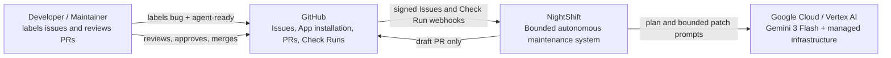
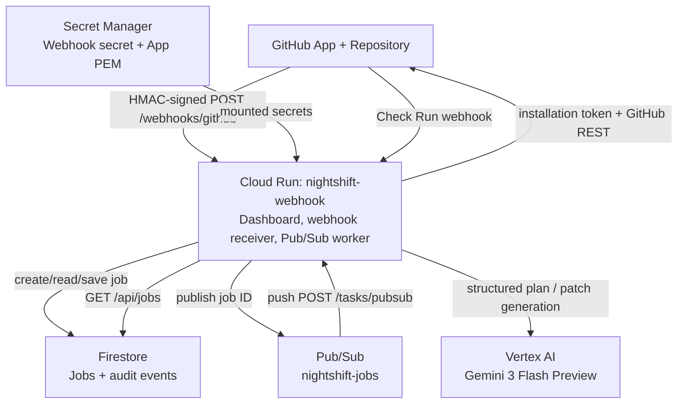
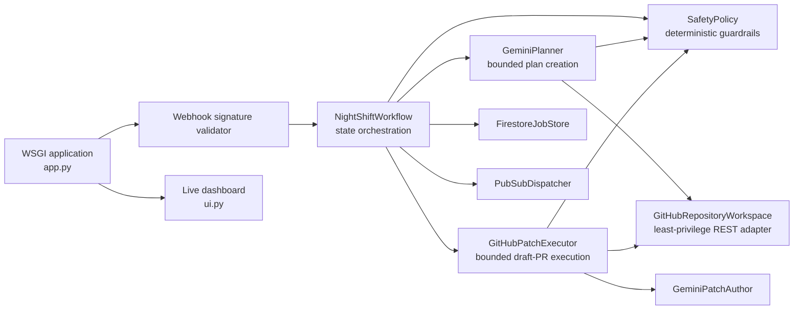
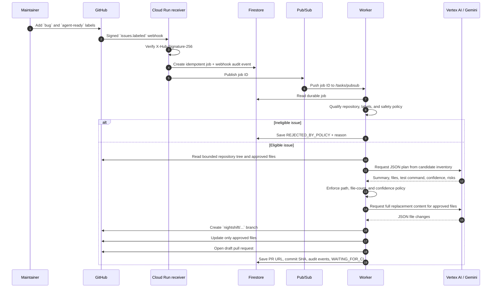
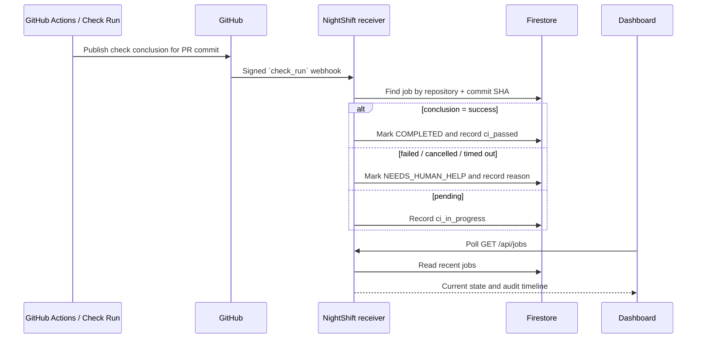
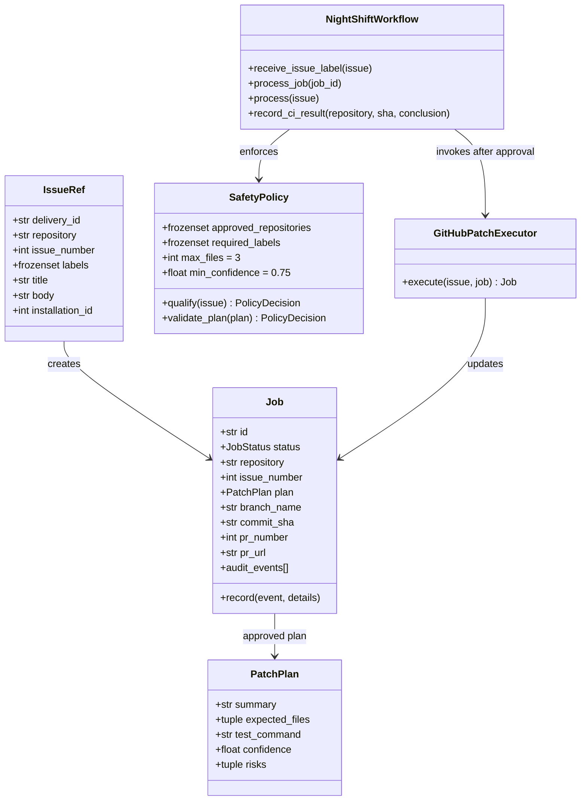
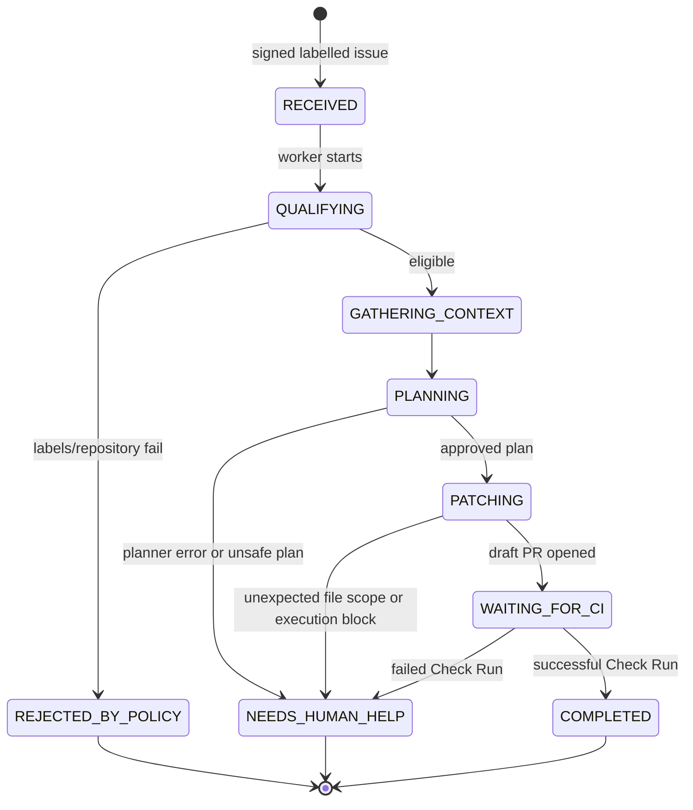

# NightShift — Autonomous GitHub Maintenance Engineer

> **One-line summary:** NightShift turns explicitly approved GitHub bug reports into tightly bounded, tested *draft* pull requests, while keeping merge authority with a human reviewer.

## 1. Project overview

NightShift is an event-driven autonomous software-maintenance agent for one approved GitHub repository. It listens for GitHub issue-label events, checks whether the issue is safe to automate, uses Gemini 3 Flash on Vertex AI to produce a constrained plan and patch, and opens a draft pull request only after deterministic guardrails approve the action.

The product is deliberately designed around **bounded autonomy**. The agent may act quickly on small maintenance work, but it cannot merge code, edit CI, change infrastructure or dependencies, touch sensitive paths, or operate outside the configured repository. Every workflow transition is persisted as an audit event and surfaced in the live dashboard.

### Problem addressed

Small bug fixes often wait behind higher-priority feature work even when the fix is well-scoped and mechanically straightforward. Existing automation can be too broad: it may have unrestricted repository access, opaque decision-making, or merge authority. NightShift addresses that gap by automating the narrow, repetitive part of maintenance while preserving an explicit human review gate.

### Primary users

- Engineering teams that want a safe maintenance backlog assistant.
- Repository maintainers who need a clear, reviewable audit trail.
- Hackathon judges evaluating agentic workflows with real cloud and GitHub integrations.

### Success criteria

1. A labelled GitHub issue enters the system automatically.
2. Unsafe or out-of-scope work is rejected before any repository mutation.
3. A qualifying issue produces at most one isolated, bounded draft PR.
4. CI status is reflected in the agent job without any auto-merge path.
5. A dashboard makes the decision history visible in near real time.

---

## 2. C4 architecture

### Level 1 — System context

**Boundary of responsibility:** GitHub owns source control, CI and merge decisions. NightShift owns qualification, planning, constrained patch execution and job auditing. The human maintainer remains the only merge authority.

### Level 2 — Container diagram

### Level 3 — Cloud Run component diagram

---

## 3. End-to-end workflow

### UML sequence diagram — eligible issue to draft PR

### UML sequence diagram — CI tracking

---

## 4. Domain model

### UML state machine — job lifecycle

---

## 5. Safety, autonomy and security model

| Control | Implementation | Why it matters |
|---|---|---|
| Explicit opt-in | Both `bug` and `agent-ready` labels are required. | Prevents accidental automation of ordinary issues. |
| Repository allowlist | `APPROVED_REPOSITORY` is checked before planning. | Limits the blast radius to one installed repository. |
| Signed ingress | Every GitHub webhook must pass HMAC SHA-256 verification. | Rejects forged webhook requests. |
| Least-privilege authentication | GitHub App installation tokens are short-lived and cached only in memory. | Avoids personal access tokens and long-lived repository credentials. |
| File boundaries | Only `nightshift/`, `tests/`, or `src/`; maximum three files. | Keeps each autonomous change small and reviewable. |
| Sensitive-path denial | Auth, secrets, credentials, migrations, dependencies, CI, Docker and infrastructure paths are rejected. | Requires human review for high-impact areas. |
| Structured model output | Gemini is instructed to emit JSON; deterministic code validates it. | The model proposes, while code decides what may execute. |
| Human merge gate | The only PR method sets `draft: true`; no merge operation exists in the repository adapter. | Eliminates autonomous deployment or merge authority. |
| Durable audit trail | Firestore persists status, PR metadata, commit SHA and timestamped events. | Makes decisions explainable and recoverable. |

### Allowed and disallowed actions

| NightShift may do | NightShift may not do |
|---|---|
| Read a bounded repository tree and existing approved files | Merge, approve, or close pull requests |
| Create a `nightshift/…` branch | Write to `main` or another arbitrary branch |
| Replace content in the approved existing files | Modify dependencies, CI, Docker, infrastructure or credentials |
| Open a draft PR | Select more than three files or operate outside allowlisted roots |
| Record Check Run outcomes | Bypass GitHub’s normal review and branch-protection rules |

---

## 6. Implementation details

### Technology stack

- **Runtime:** Python 3.12 WSGI application.
- **Compute:** Google Cloud Run, deployed as `nightshift-webhook` in `us-central1`.
- **LLM:** Gemini 3 Flash Preview through Vertex AI and the Google Gen AI SDK.
- **Persistence:** Cloud Firestore Native mode.
- **Async dispatch:** Google Cloud Pub/Sub push subscription.
- **Secrets:** Google Secret Manager for the GitHub App private key and webhook secret.
- **Source-control integration:** GitHub App installation auth plus GitHub REST API.
- **CI:** GitHub Actions test workflow; status ingested from `check_run` webhooks.
- **UI:** Lightweight responsive command-centre dashboard served by the same Cloud Run service.

### HTTP interface

| Endpoint | Method | Purpose |
|---|---:|---|
| `/` | GET | Dashboard that renders the latest job and audit timeline. |
| `/api/jobs` | GET | JSON feed of recent durable job state for the dashboard. |
| `/webhooks/github` | POST | HMAC-validated GitHub `issues` and `check_run` receiver. |
| `/tasks/pubsub` | POST | Pub/Sub push endpoint that resumes a job by ID. |

### Deployment configuration

The deployment script sets the approved repository, Google Cloud project, GitHub App client ID, private-key mount path and `GEMINI_MODEL=gemini-3-flash-preview`. Secret values remain outside source control and are mounted from Secret Manager at runtime.

### Verification performed

- Full local unit suite: **28 tests passing**.
- Static hygiene: `git diff --check` passing.
- Live Cloud Run dashboard/API health check: **HTTP 200**.
- Live signed webhook smoke test: an intentionally ineligible issue was persisted, dispatched and safely rejected for missing `agent-ready`—proving the GitHub webhook → Firestore → Pub/Sub → worker → policy path without mutating a repository.
- Cloud Run revision configured with the intended Gemini 3 Flash Preview model at 100% traffic.

---

## 7. How to demonstrate NightShift

1. Open a small, well-defined bug issue in the approved repository.
2. Add the `bug` and `agent-ready` labels.
3. Show the dashboard receiving the job and displaying its audit timeline.
4. Explain the policy gates while Gemini receives only a bounded inventory of eligible files.
5. Open the generated draft PR and show that it is isolated on a `nightshift/…` branch.
6. Let GitHub Actions run; show the Check Run result transition the job to `COMPLETED` or `NEEDS_HUMAN_HELP`.
7. Emphasize that a maintainer, not the agent, reviews and merges the change.

---

## 8. Résumé section — 6 impact-focused bullets

**NightShift — Autonomous GitHub Maintenance Engineer**  
*Python, Google Cloud Run, Vertex AI (Gemini 3 Flash), Firestore, Pub/Sub, GitHub Apps*

- Built and deployed an event-driven autonomous maintenance agent that converts explicitly approved GitHub bug reports into isolated draft pull requests.
- Designed a bounded-autonomy policy engine enforcing repository allowlists, dual-label opt-in, 3-file limits, confidence thresholds and sensitive-path exclusions before any code mutation.
- Integrated Gemini 3 Flash through Vertex AI for structured JSON planning and patch generation, with deterministic validation separating model proposals from execution authority.
- Implemented GitHub App installation-token authentication and a restricted repository adapter capable of reading approved files, creating `nightshift/` branches and opening draft PRs—without merge capability.
- Architected a production workflow on Cloud Run, Firestore, Pub/Sub and Secret Manager, providing durable job state, asynchronous execution and an audit trail for every agent decision.
- Delivered a polished live command-centre dashboard and CI feedback loop using signed GitHub Check Run webhooks; verified the solution with 28 automated tests and a live end-to-end policy smoke test.

---

## 9. Future extensions

- Add OIDC validation for Pub/Sub push requests and authenticated dashboard access for production multi-user deployments.
- Support richer repository context through code search while preserving the strict file-scope policy.
- Add PR comments containing a concise explanation of the plan, risk assessment and validation command.
- Introduce human approval queues for higher-risk changes rather than rejecting them outright.
- Add metrics for acceptance rate, time-to-draft-PR, CI pass rate and human-merge rate.

